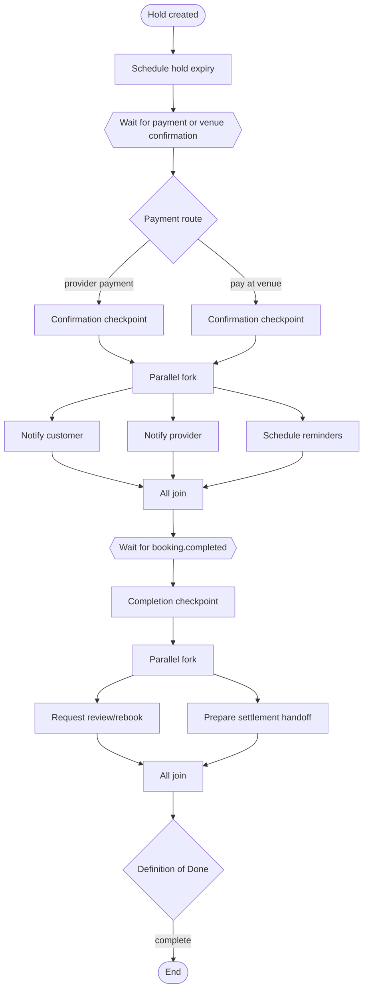

# Flow Orchestration OS

`@kajola/orchestration` provides:

- validated, immutable, versioned graph definitions;
- deterministic edge and conditional routing;
- parallel forks and `ALL`, `ANY`, or `N_OF_M` joins;
- event, timer, human and agent waits;
- registered system, external and automation handlers;
- governance checkpoints and durable evidence references;
- event receipt deduplication and optimistic instance writes;
- cancellation, explicit retry and backward compensation;
- nested flow execution and Definition-of-Done enforcement;
- correlation-backed audit reconstruction.

The local adapter is deterministic development infrastructure, not production durability certification. The migration supplies the production persistence and worker-claim model; a Supabase repository/worker adapter remains required to execute the golden flow in connected mode.

## Booking golden flow

