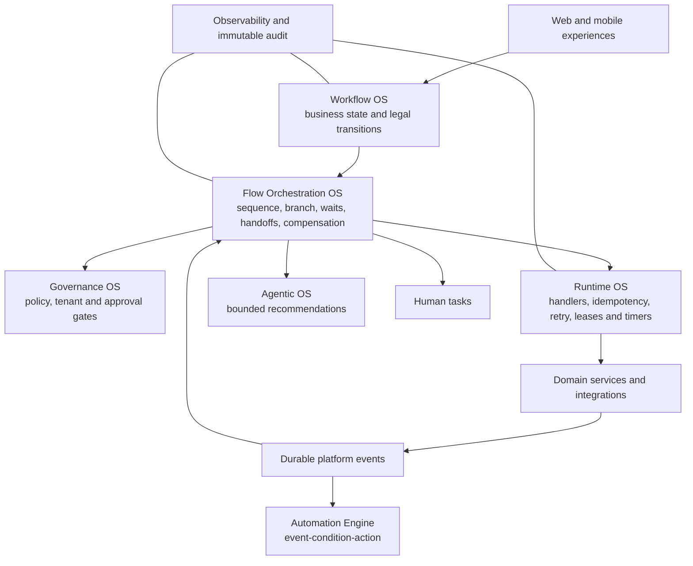

# Kajola Unified Execution Architecture

## Purpose

Kajola uses one execution model while preserving bounded ownership:

The golden flow is `kajola.booking.fulfilment@1`. Booking state legality remains in the booking domain service. The flow coordinates hold-expiry scheduling, payment/venue confirmation, parallel notifications, reminders, completion, review requests, settlement preparation, checkpoints and Definition of Done.

## Mandatory harmonization decision matrix

| Existing capability | Current location | Current responsibility | Target owner | Decision | Migration action |
|---|---|---|---|---|---|
| Booking transition guards | `apps/web/lib/local-handlers.ts`, Supabase booking functions/DB constraints | Legal booking state changes | Workflow OS/domain service | REUSE | Orchestrator observes canonical events and never sets booking status |
| Local domain events/audit | `apps/web/lib/domain-runtime.ts` | Development event and evidence records | Observability/Audit + event adapter | WRAP | Convert records to the shared `PlatformEvent` at the orchestration boundary |
| `system_events` | migration and `process-events` function | Production outbox and automation inbox | Event infrastructure | EXTEND | Add correlation, causation, flow and actor fields |
| Automation rule engine | `packages/automation`, automation Edge Functions | Event-condition-action | Automation Engine | KEEP_SEPARATE | Flow automation nodes invoke registered handlers; rules may trigger flows later |
| Event processor retry loop | `supabase/functions/process-events` | Delivery retry/backoff | Runtime OS | MIGRATE | Retry decision moved to `runtime_helpers.ts`; worker retains delivery loop |
| Local workflow jobs | `store.workflows`, `scheduleWorkflow` | Development timer intent | Runtime OS adapter | WRAP | Booking flow handlers schedule existing jobs with stable orchestration evidence |
| Database cron/hold expiry | migrations and database functions | Durable temporal wake-up | Runtime OS | REUSE | No second scheduler introduced |
| Direct Anthropic generator | `/api/generate` | Architecture content generation | Agentic OS adapter | KEEP_SEPARATE | Not part of transactional booking correctness; future adapter required |
| Session/RBAC checks | middleware, route handlers, RLS | Authentication and authorization | Identity/Authorization | REUSE | Governance gates add policy decisions without replacing authentication |
| Operator dashboard | admin UI and runtime endpoint | Operational evidence | Operator control plane | EXTEND | Add flow status, trace and governed recovery endpoint |
| Audit tables | `audit_logs`, local audit store | Immutable business evidence | Audit | EXTEND | Add flow audit entries linked by correlation ID |
| Payment webhooks | payment Edge Function | PSP validation and payment truth | Payment domain/integration | WRAP | Emit normalized events; do not move signature validation into orchestration |

## Authoritative ownership

| Concern | Primary owner |
|---|---|
| Business state and legal transitions | Workflow OS/domain services |
| Sequencing, dependencies, waits and compensation | `@kajola/orchestration` |
| Jobs, retry, leases, locks and wake-up delivery | Runtime OS |
| AI reasoning and structured agent output | Agentic OS |
| Policy, evidence and approval gates | Governance OS |
| Event-condition-action rules | `@kajola/automation` |
| Metrics and traces | Observability |
| Immutable execution evidence | Audit |

## Persistence

Production structures are introduced by `20260904000000_flow_orchestration_os.sql`. Active definitions are immutable, instances use optimistic `lock_version`, worker claims use `FOR UPDATE SKIP LOCKED`, task effects have unique idempotency keys, and event receipts deduplicate replay. The current web golden flow uses the explicit local development repository; connected Supabase orchestration execution remains a release condition.

## Harmonization summary

- REUSED: booking transition guards, RLS/auth, automation rules, database cron, notification/payment domain adapters.
- EXTENDED: `system_events`, operator evidence, audit persistence.
- WRAPPED: local domain events, scheduler, notification effects.
- MERGED: correlation and actor contracts into one platform envelope.
- MIGRATED: booking confirmation/completion coordination and automation retry policy ownership.
- DEPRECATED: generic booking status route remains a compatibility API; intent-named transitions are the removal criterion.
- REMOVED: direct local confirmation/reminder/review side effects from booking handlers.
- KEPT_SEPARATE: Workflow, Flow Orchestration, Runtime, Agentic, Governance, Automation, Observability and Audit.

Legacy production booking functions still coordinate their own side effects. They remain the largest migration risk and must be adapted before production certification.
